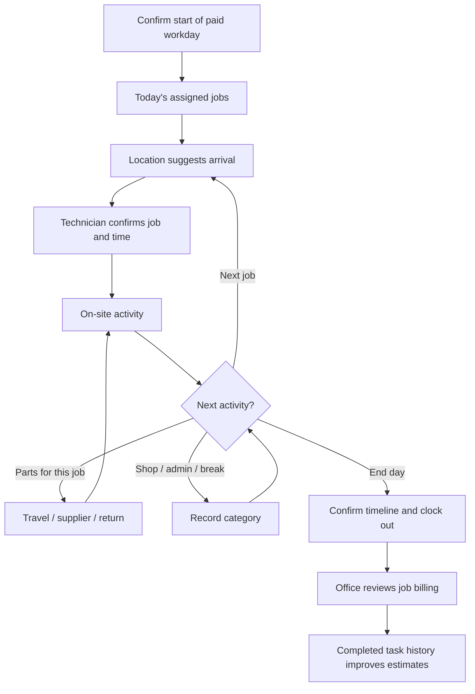

# iPhone timekeeping and job activity plan

Status: planning only. No location collection, payroll changes, or invoice automation is enabled by this document.
Branch: `feature/gps-timekeeping`. Updated September 22, 2026.

## Agreed pilot choices

- Use company-owned iPhones.
- Location creates suggested entries. The technician confirms or corrects them before they become submitted work records.
- Capture the whole working day: on-site work, job travel, parts runs, shop/admin time, callbacks, breaks, and unallocated time.
- Retain the existing employee-only timecard access, with Craig as the admin exception. Office billing reviewers receive job activity needed for billing, not other employees’ payroll or location histories.

## Outcome

Explain how the workday was spent, connect multiple visits and a parts trip to the same work order, identify charges that still need review, and build estimates from comparable completed tasks. A location observation is evidence for a proposed time entry; it does not establish what work occurred, whether a break was taken, or whether the owner owes a charge.

Keep three separate records connected by identifiers:

1. **Paid workday:** existing Timekeeping shifts, breaks, employee certification, and admin review.
2. **Job/activity timeline:** confirmed segments describing the work and which job benefited.
3. **Billing:** reviewed, authorized charges and their invoice coverage. Observed time never issues an invoice by itself.

Leaving a property ends or suggests ending the on-site segment. It must not clock the employee out of the paid workday. Ending the workday requires explicit confirmation.

## Phone experience

### Start day

- Sign in with the company Microsoft account; tap **Start workday** to confirm the payroll clock-in and activate location assistance.
- Show **Today’s jobs** from assigned HDPM visits, with address, unit, work-order number, approved scope, estimated task time, appointment window, and route link.
- Distinguish a saved HDPM appointment from an AppFolio-only appointment. Do not imply the current local calendar already includes everything.
- Allow **Add assigned job / find work order** for an authorized unscheduled call. A location suggestion does not authorize extra scope or charges.
- Keep **Current activity**, **Change activity**, **Parts run**, **Break**, **End workday**, and **Review today** within easy reach.
- Show tracking status, pending confirmations, last sync, and offline status. Manual entry remains available without location permission or connectivity.

### Arrival

- Monitor the day’s assigned properties and relevant suppliers. After a sustained arrival, suggest: “At Cedar Creek, unit 409? Start work at 8:03?”
- Offer **Confirm**, **Choose another job/unit**, **Adjust time**, or **Not working here**.
- Preserve the observed candidate time so a later confirmation need not start the entry late. Show uncertainty rather than claiming exact arrival time from a delayed geofence event.
- Multiple units or nearby properties require selection. GPS cannot identify which unit or task was worked on.
- Passing a property should not start a timer. Initial pilot settings to tune on real phones: roughly 100–150 m boundaries, a short dwell, accuracy checks, and a larger exit boundary to reduce repeated entry/exit events. These are hypotheses, not promised GPS precision.

### Departure and parts run

- Suggest ending the current on-site segment, then ask for the next activity when the technician can respond safely: **Parts for this job**, **Next job**, **Shop/admin**, **Break**, or **End workday**.
- An ignored suggestion stays pending. Do not silently approve it or convert the elapsed interval to unpaid time.
- **Parts for this job** retains the same work order and work session while the activity changes through travel → supplier stop → return travel → on-site work.
- The phone can suggest Lowe’s as a supplier stop. The technician confirms its purpose and benefiting job; supplier proximity alone cannot establish that.
- Returning to the property offers **Resume this job**. The trip and both visits stay linked, with each segment visible and separately reviewable.
- A trip serving several jobs needs an explicit split or shared-parts activity pending allocation. Allocated minutes must add up to the actual segment; never duplicate the whole trip across jobs.
- General inventory shopping, callbacks, and admin time retain their own categories. The office decides job attribution and billability using the approved scope and charge policy.

### Review and end day

- Present an editable timeline with gaps, overlaps, uncertain locations, and unconfirmed suggestions highlighted.
- Confirm job, task, start/end, activity, progress, materials, and notes. Allow split/merge corrections with an audit trail; merge presentation never removes the underlying segments.
- Show confirmed worked time, job activity, other activity, breaks, and unallocated time separately. Never auto-fill unknown time as job labor.
- **End workday** confirms the shift end, stops location collection and region monitoring, and prompts for unfinished entries. An idle/end-of-schedule reminder must not silently close the paid shift.
- Break controls record the employee’s actual break choice through existing Timekeeping rules. Pause location collection during personal breaks; a location gap alone never creates a break or deduction.
- Approved/signed payroll records are not rewritten by late GPS events. Corrections follow the existing return/review process.

## Example: one job with a Lowe’s trip

Illustrative data, not employee records:

| Time | Activity | Job link | Minutes |
| --- | --- | --- | ---: |
| 8:00–9:20 | On-site work | Job A | 80 |
| 9:20–9:35 | Travel to Lowe’s | Job A | 15 |
| 9:35–9:55 | Parts pickup | Job A | 20 |
| 9:55–10:10 | Return travel | Job A | 15 |
| 10:10–11:00 | On-site work | Job A | 50 |
| **Total** | **One connected work session** | **Job A** | **180** |

The job consumed 3 hours: 2 h 10 m on site, 30 m travel, and 20 m parts pickup. The billing reviewer determines which segments are chargeable. A flat-price job retains its approved price; these hours inform cost and future estimates rather than automatically increasing the invoice.

## iPhone architecture

Recommend a small native SwiftUI iPhone app using Core Location, backed by the existing Next.js/Supabase system. Keep scheduling, review, invoices, and admin reporting in HDPM OS. A web-only location tracker is not the foundation for screen-locked/background detection.

- Apple supports geographic condition monitoring and background location with appropriate configuration and authorization. Events can be delayed; apps can be suspended or terminated. Recreate the location services correctly on launch and expose interrupted tracking to the user.
- Apple limits simultaneous monitored conditions to 20. Prioritize today’s stops and relevant suppliers, rotate monitored regions as the day changes, and handle restart/unlock. Do not register the full property portfolio.
- Prefer region monitoring plus adaptive location sampling during an active workday over a continuous high-frequency breadcrumb upload. Measure battery and event quality on the actual company phones before choosing sampling thresholds.
- Use local notifications and an in-app confirmation inbox. Batch repeated observations, and never require responding while driving.
- Encrypt the offline event outbox; retry safely after reconnecting. Use device event IDs, sequence numbers, observed time, receipt time, and accuracy so retries and late uploads cannot duplicate or reorder paid work silently.
- Use a company mobile OAuth flow with PKCE, device registration, and revocable credentials. Reuse server-side staff checks; never place Supabase service credentials in the app. The existing browser-cookie authentication is not by itself a mobile authentication design.
- Pilot through the company’s Apple distribution setup. Confirm Apple developer access, phone/iOS versions, and TestFlight/managed deployment before implementation begins. Company ownership does not remove Apple’s permission requirements.

## Data and integration plan

Reuse `timekeeping_clock` / `timekeeping_sheet`, `maintenance_job`, `maintenance_task`, `maintenance_visit`, `maintenance_work_record`, and current invoice allocation/review flows. Avoid a second competing timecard or independently billable duplicate work log.

Proposed additive data, with names finalized during implementation:

| Record | Purpose |
| --- | --- |
| `field_device` | Employee-bound device, authorization/health state, last sync, revocation. One primary device for an active work session. |
| `work_location` | Reviewed property/supplier coordinates, radius, address provenance, active version. No tenant location tracking. |
| `field_location_event` | Minimal evidence: employee/device event ID, observed/received times, event kind, accuracy, region/config version, and optional required fix. |
| `field_work_session` | Paid-shift reference and connected job visit/parts episode; can span multiple site segments. |
| `field_activity_segment` | Proposed/confirmed/corrected interval, kind, job/task, origin evidence, confidence, reviewer, and version. |
| `field_activity_allocation` | Audited allocation for multi-job activity; allocation minutes cannot exceed the segment. |
| Work-record provenance | Link confirmed segments to canonical maintenance work records, with uniqueness constraints to prevent double submission. |

State model: observed event → suggested interval → technician confirmation → submitted work record → office billing disposition. Dismissed or corrected observations remain auditable until evidence retention expires.

Server rules:

- Derive employee identity from authentication; validate every job and device association. Enforce access on the server and database.
- At most one active primary activity per employee. Store intervals with unambiguous boundaries and audit changes; do not double-count overlapping observations or multiple devices.
- Keep the exact confirmed interval; do not repeatedly round short segments into extra invoice/payroll minutes. Display rounded summaries separately.
- Store UTC timestamps and derive Pacific work dates. Handle midnight, daylight-saving changes, and split periods without losing minutes.
- Device time and late uploads are evidence, not authority. Flag excessive clock skew, conflicting changes, missing shift coverage, and low-quality intervals for review.
- A confirmed segment produces or updates its linked work record once. Existing manual records require explicit matching before creating another. Invoice/task locks and optimistic versions continue to apply.
- Payroll clocks keep their current authorization and certification rules. Add a reviewed reconciliation path for historical activity; do not send historical GPS events through a “clock now” action or label them as verified clock punches.
- Callbacks and shop/admin need explicit categories, even where the current daily closeout groups some into “other.” Shared trip allocations need new schema rather than duplicated records.

## Office experience and estimate feedback

Extend Daily Billing Review with a per-job timeline, confirmed vs suggested minutes, travel/parts breakdown, invoice coverage, and a queue for missing job links, corrections, and uncertain intervals. An office reviewer can review the job evidence without accessing payroll details or a live employee location feed. Craig retains the cross-employee paid-time comparison.

For future estimates, aggregate confirmed, reviewed records by task/price-book item and meaningful job characteristics: quantity, property/unit type, condition, travel, materials, and callback status. Separate crew-hours from elapsed visit time when multiple technicians work together.

Show sample count, median actual labor, a useful range, parts/travel overhead, and estimated-versus-actual variance. Retain unusual jobs with explanatory labels and exclude uncertain/unallocated time from the baseline. Do not silently change prices or treat one job as a reliable benchmark.

Brody drafts the estimate; Alberto uses comparable history to check labor and quantities. The authorized reviewer checks scope and price before owner approval. Proposed initial display threshold: at least five comparable reviewed jobs; below that, show individual examples and “limited history.” Confirm the threshold after the pilot. Scheduling uses expected visit time plus travel; billing uses the approved pricing method.

## Access and collection boundaries

- Collect work location only during an explicitly active workday; show a clear indicator and stop at end day. No off-duty/home-history collection or hidden 24-hour tracking.
- Technicians see and correct their own timeline. Craig sees cross-employee payroll comparisons and location evidence needed for exceptions. Office staff see authorized job activity, not raw precise location history or personal breaks.
- Log review/correction access and reasons. Missing permission, signal, or phone charge creates a documentation exception, never an automatic adverse conclusion or unpaid deduction.
- Proposed pilot retention: up to 30 days for raw location evidence, then delete it automatically; preserve confirmed business records under the existing retention policy. Finalize the company’s notice, access, and retention settings before collecting real employee location.

## Build sequence and release gates

1. **Foundation in HDPM:** phone-friendly Today list, manual activity transitions, connected parts-run episodes, confirmations, canonical work-record links, privacy controls, and office review. No GPS needed to test the accounting model.
2. **Native iPhone pilot:** Microsoft sign-in, Start/End day, location permission/status, region monitoring, encrypted offline outbox, and confirmation notifications. Pilot with Alberto and Brody on company phones, if assigned by Craig.
3. **Daily billing reconciliation:** resolve gaps and mixed-job trips; show confirmed activity beside drafts/issued invoices and the admin-only paid-time comparison. No automatic payroll edits or invoice issuance.
4. **Estimate history:** comparable-task summaries and variance explanations inside estimate preparation; human review continues.

Run the location pilot in suggestion-only mode for two working weeks, with a short daily review. Keep existing timecard certification and office invoice review throughout. Do not introduce automatic job switching without a later explicit decision informed by the pilot.

Pilot measures: correctly linked visits, missed/false arrival/departure suggestions, correction minutes, unexplained time, confirmation effort, battery consumption over a full day, offline recovery, and actual billing discrepancies found. Agree success thresholds after a baseline day; GPS precision and billing recovery are not assumed in advance.

Required scenarios before expansion:

- One job, a round trip to Lowe’s, and return to the same job; totals preserved without duplicate entries.
- Parts for two jobs; allocation conserved; general inventory remains separately classified.
- Neighboring properties, multiple units, drive-bys, GPS drift, and poor signal indoors.
- Locked screen, backgrounded/terminated app, reboot/unlock, battery-saving mode, location permission reduction/revocation, and dead phone.
- No signal all afternoon, duplicated/reordered uploads, device clock changes, and two devices attempting to track the same shift.
- Breaks, forgotten confirmation, after-hours calls, midnight/daylight-saving transitions, and approved timecards.
- Manual work records already present, already-billed tasks, flat-price scope, shared crews, and returned work corrections.
- Employee A cannot access employee B’s payroll or location. Office billing permissions do not expose raw GPS. End-day and break behavior stops collection as designed.

## Still to decide before implementation/pilot

- Company device inventory, supported iOS versions, Apple developer/distribution access, and mobile sign-in setup.
- Who reviews daily activity exceptions and who owns moving approved work from the scheduling queue to the calendar.
- Approved rules for charging travel, parts pickup, callbacks, and shared trips; these must not be inferred from GPS.
- Confirm pilot participants, company notice, raw-evidence retention, property geocodes, supplier locations, and measurable acceptance thresholds.

## Platform references checked September 22, 2026

- [Apple: monitoring proximity to geographic regions](https://developer.apple.com/documentation/corelocation/monitoring-the-user-s-proximity-to-geographic-regions) — background region events, condition limit, restart/unlock behavior.
- [Apple: handling location updates in the background](https://developer.apple.com/documentation/corelocation/handling-location-updates-in-the-background) — background capability, authorization, lifecycle, and delayed updates.
- [WebKit: tracking prevention](https://webkit.org/tracking-prevention/) — background Geolocation Sensor is listed among APIs not implemented; a home-screen web app is not the chosen background-tracking architecture.
