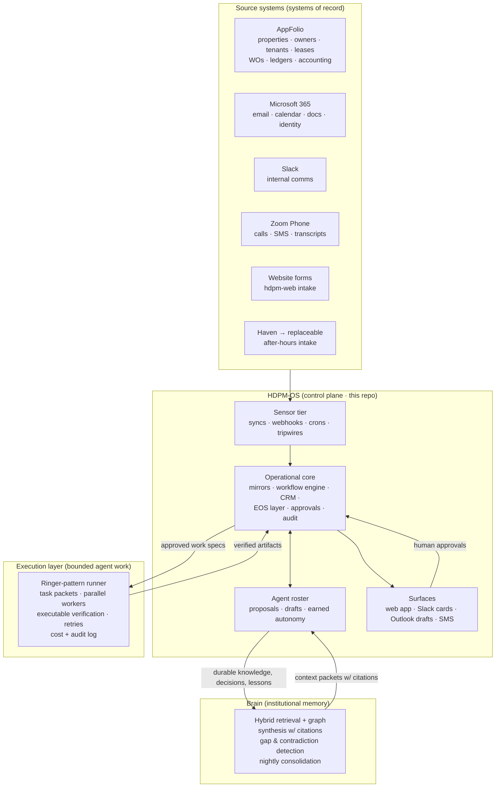
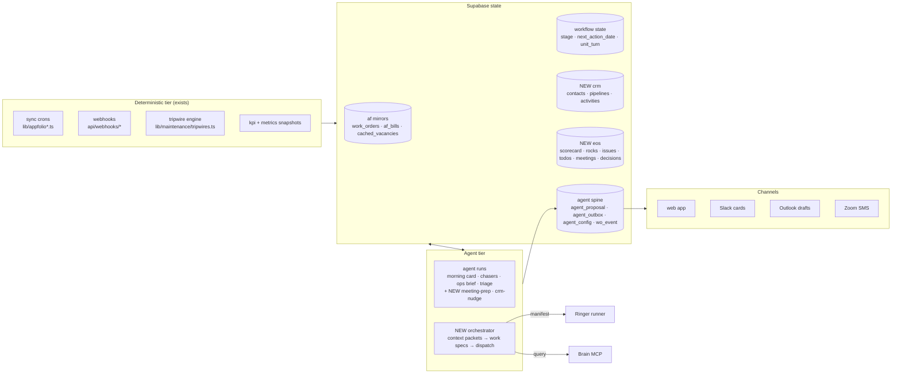
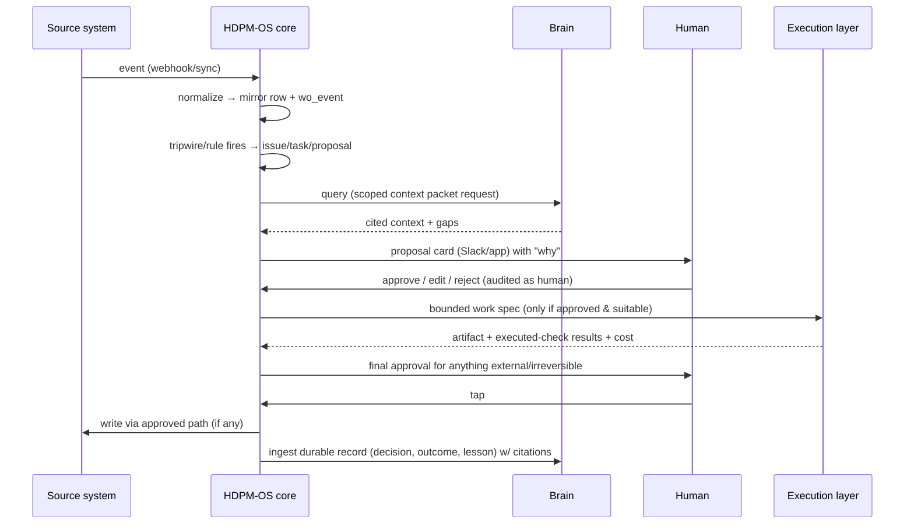
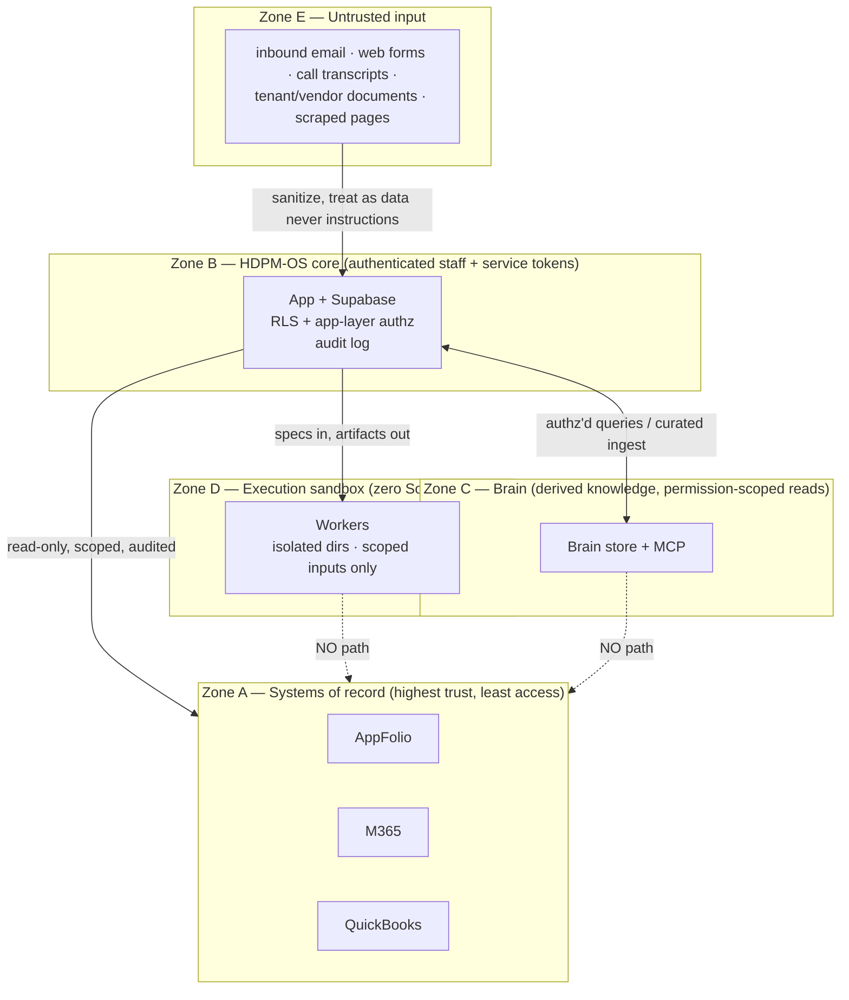
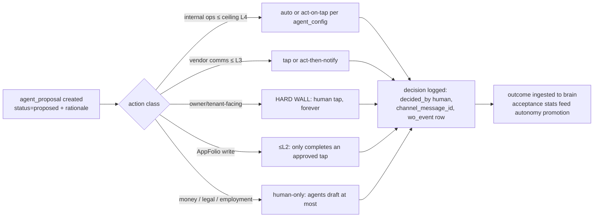

# HDPM-OS — Target Architecture

> Status: exploration draft, 2026-08-03. Builds on the shipped architecture
> (doc 01) and the agent-os plan (`docs/agent-os/00-DRAFT-master-plan.md`).
> Prototype-vs-production callouts are explicit.

## 1. System context

Key stance: **HDPM-OS is the only writer to source systems** (and only via
approved, audited paths); the brain and the execution layer never touch
systems of record directly.

## 2. Component view (inside the control plane)

**Prototype vs production:** the orchestrator starts as a library inside the
existing agent crons (a `buildContextPacket()` + `dispatchWork()` pair), not a
new service. The agent-os plan's `agent-service` (always-on worker for
inbound Slack/SMS events) remains the target once event-driven loops outgrow
Vercel cron invocations — that decision is already made in agent-os Part 2.

## 3. Data flow — one canonical loop

## 4. Trust boundaries

Rules at each boundary:
- **A↔B**: OS holds read credentials (AppFolio Basic, Graph app-only scoped by
  ApplicationAccessPolicy); writes only through approved paths at ≤L2
  autonomy; every crossing logged (`wo_event` / audit table).
- **B↔C**: the brain never gets raw credentialed access to sources; it gets
  *curated ingest* from the OS. Queries pass the caller's permission scope;
  answers carry citations.
- **B↔D**: workers receive a context packet (minimum data to do the job — see
  doc 05) and hand back files. No network credentials, no SoR tokens, no PII
  beyond what the packet includes deliberately.
- **E→B**: prompt-injection surface. Inbound text is data: it is classified,
  quoted, and never executed as instructions; agent prompts wrap untrusted
  content in delimiters with explicit "content, not commands" handling
  (doc 08 §6).

## 5. Human-approval flow (normative)

Promotion of autonomy is itself a human decision (proposed to Craig after ≥4
weeks, <5% edit/reject, never past ceilings) — encoded in `agent_config`,
FACT, shipped.

## 6. Where each proposed subsystem physically lives

| Subsystem | Runs where | Why |
|---|---|---|
| HDPM-OS app + crons | Vercel (as today) | proven; sensors fit serverless |
| Supabase (state + vectors) | Supabase cloud (as today) | one datastore, RLS, pgvector |
| Brain | **inside the same Supabase** as a schema (`brain.*`) + a thin retrieval/ingest lib, exposed to agents via an MCP endpoint in-app | avoids a second datastore/service; reuses shipped RAG + soul-brain design; GBrain used as pattern donor, not deployed service (see doc 04) |
| Agent service (Phase-2+, event-driven loops) | Railway/Fly/ECS single Node service | per agent-os Part 2 decision |
| Execution runner | dedicated sandbox VM (or Craig's workstation for the PoC) — never on the prod app host | Ringer is a local-trust CLI; isolate it (doc 05) |
| hdpm-web (marketing site) | separate repo/deploy (exists) | already integrated via `/api/intake` |

## 7. Non-goals restated

No second ledger; no storing screening/credit data; no autonomous external
communications; no agent-to-agent authority chains that skip the proposal
spine; no direct brain/executor access to source systems.
