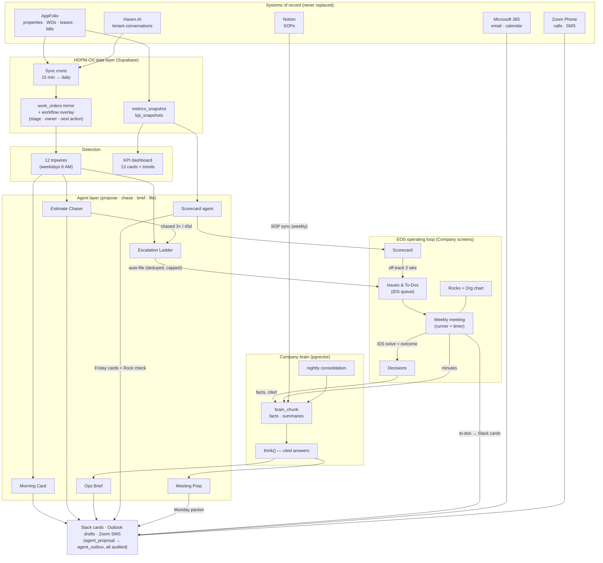
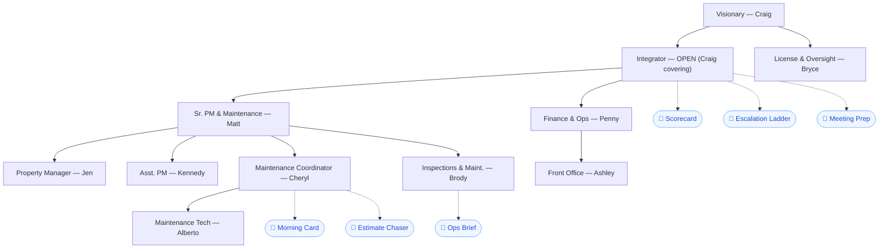

# HDPM-OS — Mission, System Schematic, and the Agent Roster

> Status: living document, created 2026-08-04 (Phase 2 complete). This is the
> one-page answer to "what is this system, what is it for, and who does what."
> Deep dives: `02-product-vision-and-boundaries.md` (boundaries + authority
> map), `06-eos-operating-layer.md` (cadence), `docs/maintenance-os/`
> (maintenance), `docs/agent-os/` (agent conventions).

## 1. Mission

**Run High Desert Property Management like a system: every door, every
dollar, and every decision visible, owned, and remembered.**

HDPM-OS is the company operating system for HDPM (~835 doors / 467
properties, Central Oregon, ~11 staff). It is a control plane over the
systems the company already runs on — AppFolio (system of record), Microsoft
365, Slack, Zoom Phone — plus the four capabilities those systems don't
provide:

1. **Accountability** — every open work item has one human owner and a
   next-action date; twelve tripwires make silent failure impossible.
2. **Cadence** — an EOS-style operating loop: scorecard → issues → weekly
   meeting → decisions → to-dos, run in-tool, every week.
3. **Agents** — a roster of scoped AI teammates that watch, chase, brief,
   and file. Agents propose and escalate visibility; **humans decide**.
   Every agent action is audited; autonomy is earned per action and
   permanently capped for anything owner- or tenant-facing.
4. **Memory** — a company brain that ingests SOPs, decisions, and meeting
   minutes, and answers with citations — so knowledge outlives whoever
   happened to be in the room.

### Goals & the numbers that define winning

| Horizon | Goal | Measured by |
|---|---|---|
| North star | Grow ~835 → **1,500 doors** without proportional headcount | KPI dashboard (net doors vs goal line) |
| Maintenance | No work order stuck, silent, or unowned | Open exceptions → **0** on a clean day; 30+ day bucket **< 5**; every WO has owner + date |
| Cadence (Phase 2 acceptance) | The operating loop actually runs | **4 consecutive weekly meetings in-tool**; **≥ 90 % to-do completion**; decisions land in the brain with citations |
| Adoption | Staff work *through* the system | **≥ 25 human actions/week** through agent cards & drafts |

### The weekly scorecard (goals provisional until reviewed)

| Metric | Goal | Owner |
|---|---|---|
| Open exceptions | ≤ 150 | Brody |
| Staff actions via agent surfaces (7d) | ≥ 25 | Craig |
| Stuck estimates (open) | ≤ 20 | Cheryl |
| Estimate decision latency (median) | ≤ 7 days | Cheryl |
| Vendor accepted-but-unworked WOs | ≤ 30 | Matt |
| Open unit turns | ≤ 10 | Matt |
| Median days vacant (turns) | ≤ 21 | Matt |

Auto-filled every Friday 3 PM PT from `metrics_snapshot`; two weeks off-track
auto-files an issue for the Monday meeting.

## 2. System schematic

The loop that matters: **detection** (tripwires, metrics) feeds **agents**,
agents escalate visibility into the **IDS queue**, the **weekly meeting**
turns issues into **decisions and to-dos**, and decisions/minutes land in the
**brain** — which then makes next Monday's prep packet smarter. Nothing
escalates by pressure, everything escalates by visibility.

## 3. The agent roster

Every agent output is an `agent_proposal` row (audit + approval), every
outbound message goes through `agent_outbox` (channel adapters), autonomy is
data in `agent_config` (L0 observe → L4 silent, owner/tenant-facing capped at
L2 forever, global kill switch). All times Pacific.

| Agent | When | What it does | Audience | Autonomy |
|---|---|---|---|---|
| **Morning Action Card** | Weekdays 6:30 AM (+1 PM nudge) | Picks the day's 7 most important tripwire exceptions into a Slack card with Done / Snooze / Set-date / Reassign taps | Cheryl (interactive), Brody + Matt (read-only), email mirror | L2 |
| **Estimate Chaser** | Weekdays 6:45 AM | Works the stuck-estimate pool (tripwire #11): vendor-bid chase emails as Outlook drafts, SMS-first chases via the Slack text queue, owner-approval asks; 3-business-day cooldown, never a dollar amount | Cheryl (drafts + taps) | L1–L2 |
| **— escalations** | same run | Anything chased 3× or 45+ days stuck becomes an escalation DM | Brody + Matt | L3 |
| **Ops Brief** | Daily ~5 PM + Monday deep 8 AM | The supervision roll-up: metrics + deltas, agent activity, open escalations with [Acknowledge] taps, brain context | Brody (interactive), Matt + Craig (read-only) | L3 |
| **Escalation Ladder** | Weekdays 7:15 AM | Files EOS issues so nothing evaporates from a DM: tripwires aged 21d+ or recurring (episodes, not persistence), chaser escalations, twice-missed to-dos (roll once + one nudge, then file). Deduped on open source_ref, capped 10/rung/run worst-first | Issues queue | files only — never solves |
| **Scorecard agent** | Friday 3 PM | Auto-fills the weekly scorecard from `metrics_snapshot`, nudges owners of missing manual numbers, files issues at 2 weeks off-track; sends the **Friday Rock check** (one-tap On/Off per rock) | Metric & Rock owners | L2 |
| **Meeting Prep** | Monday 7:30 AM | Ensures this week's L10 exists, builds the prep packet (scorecard deltas, aged issues, to-do done rate, cited brain context), DMs the facilitator | Facilitator (Craig) | L1 — prepares, never decides |
| **AI Triage** | On demand (board) | Batch Claude triage of untriaged WOs: summary, risk flags, proposed priority/date/owner — nothing applies until a human taps | Board users | L1 |
| **Knowledge Chat / Agent API** | Interactive | Hybrid retrieval (ORS 90 + SOP corpus + brain) with inline citations; `think()` powers the packet/brief context | All staff | read-only |
| **Brain dream cycle** | Daily 3 AM | Nightly consolidation: summarize, reconcile contradictions, decay stale salience | — | internal |

Supporting report crons (not agents): tripwire email digests (6 AM),
verified-but-unbilled report to Penny (Monday), Haven response digest,
reception call report.

## 4. Agent org chart — agents under seats, never as seats

Humans hold seats (doc 06 §3); agents are attached to the seat whose work
they do. The mapping is `SEAT_AGENTS` in `lib/eos/org.ts` (provisional) and
renders on **Company → Org**.

Rationale: the Integrator seat owns the cadence, so the cadence agents hang
there (that seat is open — its agents are effectively the acting Integrator's
staff); Cheryl's seat owns WO intake and the estimate queue; Brody is the Ops
Brief's interactive recipient. Review with Craig; promote the map to a DB
column only if it starts changing.

## 5. Where things live — surfaces

| Surface | What | Why there |
|---|---|---|
| **Slack** | Morning card, chase queue, escalations, Ops Brief, Friday scorecard/Rock cards, Monday packet link, to-do cards, all one-tap actions | Meet staff where they live; notification + tap surface |
| **Web — Company** (`/company/*`) | Scorecard · Issues & To-Dos · Meetings · Rocks · Org | Deep work: the queue, the meeting runner, the chart |
| **Web — Maintenance** (`/maintenance/*`) | Board, WO detail, triage, invoices, inspections, turnover | The maintenance command center |
| **Web — `/`** | Chat + canvas agent interface | Ask anything, cited |
| **Outlook** | Chase drafts in Cheryl's Drafts folder | Human sends; agent never emails a vendor directly |
| **Email** | Tripwire digests, morning-card mirror | Fallback channel |

The design rule (doc 06 §8): **Slack notifies, the web app is where deep
work happens** — nobody has to learn the app to attend the meeting, and
nothing important lives *only* in a DM (the escalation ladder guarantees it).
