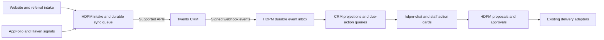

# Twenty CRM integration assessment

Date: 2026-09-22. Recommendation: proceed to an isolated owner-acquisition pilot; do not migrate all pipelines yet.

Reviewed HDPM commit `7acd8b791a789487167fbf7b007b2128cf291cdf` and Twenty main commit `70de8f4ca0a2a5bb2c97beb8e78eefe633c1c57b`. Twenty was cloned to `/tmp/hdpm-twenty-review`. This is a source/documentation assessment, not a deployed integration or runtime validation. Main-branch capabilities must be checked against the release selected for a pilot.

## Recommendation and tradeoff

Twenty is a strong candidate for HDPM's staff-facing CRM: contacts, opportunities, configurable fields, Kanban/table views, tasks, notes, relationships, and APIs cover much of the generic CRM work. HDPM still needs to build its source adapters, matching, attribution preservation, next-action enforcement, and operational handoffs.

Run Twenty separately and connect through its supported APIs. Keep hdpm-chat as the operational home and conversational interface, with pipeline summaries, due follow-ups, and links to Twenty records. Using Twenty's interface for detailed CRM editing is where most of the implementation savings come from. Rebuilding its whole interface inside hdpm-chat substantially reduces that benefit.

This changes the exploration draft in `07-crm-and-workflows.md`, which assigns CRM authority to HDPM's database. If adopted, explicitly revise that decision: Twenty owns selected sales fields; Supabase holds integration state and projections. Do not leave two independently editable sources of truth.

## Current HDPM integration points

| Existing component | Observed behavior | Integration needed |
|---|---|---|
| `app/api/intake/referral-lead/route.ts`, `lib/referrals/leads.ts` | Captures organic and referral owner inquiries, partner attribution, UTM, website lead ID, duplicate flags and stage events | Create/link Person and owner Opportunity; preserve original attribution |
| `app/api/intake/rental-analysis-request/route.ts` | Creates a requested `rent_analyses` row; does not create a CRM opportunity in this handler | Link the request to an existing opportunity or create one through a shared intake service |
| `lib/lead-webhook.ts` | AppFolio lead status/source events feed a KPI cache | Hydrate contact details separately; these rows alone are insufficient for a contact migration |
| Haven conversation and AF-lead matching | Existing conversation/lead linkage | Attach activity references to the correct leasing prospect and property |
| `lib/referrals/types.ts` | Existing submitted → contacted → qualified → agreement_signed → onboarding → active → closed/lost lifecycle | Define a deliberate mapping; sales won, agreement signed and property active are different milestones |
| CRM exploration draft | Owner/leasing pipelines, mandatory next-action dates, onboarding and renewal workflows | Use as requirements, not as evidence that those features are already implemented |
| Agent proposal/outbox layer | Existing approval, audit and channel delivery architecture | CRM follow-up drafts should enter this layer |

The current referral service flags probable duplicates after insertion; it is not an idempotent cross-system import mechanism. Its stage setter writes an event and triggers partner notifications, so mirroring Twenty updates through it requires transition deduplication and explicit notification rules.

## Functional fit

| Requirement | Fit | Remaining work |
|---|---|---|
| Owner acquisition | Strong | Custom attributes, source ingestion, follow-up ownership and stage mapping |
| Leasing | Moderate | Haven/AF identity resolution, per-property opportunities and AF-owned status mapping |
| Referral management | Partial | Keep partner access, agreements, fee terms and payout-related records in HDPM |
| Conversational CRM in hdpm-chat | Strong API foundation | Authorized tools for search, overdue deals, activity logging and proposed updates |
| Mandatory owner and next action | Needs proof | Custom fields alone do not establish an invariant; validate UI and API write paths |
| Full operational workflow replacement | Unproven | Evidence gates, pinned workflow versions and operational approvals require separate evaluation |

Twenty's pipeline documentation describes a Kanban view grouped by an object's Stage field. Do not assume independent stage definitions per filtered pipeline. Start with owner acquisition on Opportunities; evaluate a separate Leasing Inquiry custom object for a distinct lifecycle. A person can have several opportunities, including different properties and repeat inquiries.

## Proposed ownership and model

| Data | Authoritative system after an explicit cutover |
|---|---|
| Prospect CRM details, salesperson, sales stage, next action, lost reason | Twenty |
| First-touch referral source, partner terms, original intake and attribution history | HDPM/Supabase |
| Property, unit, tenant, lease and managed-owner operational facts | AppFolio |
| Rent analyses, operational checklists, agent approvals and outbound delivery | HDPM |
| Source documents and source messages | Existing M365/Zoom/Haven systems; CRM stores references or selected activity copies |

Suggested owner Opportunity additions: stable `hdpmLeadId`, source reference, partner reference, property/portfolio references, unit count, acquisition source, next-action date and note, lost reason, rent-analysis link, agreement-signed date and onboarding reference. Map staff IDs to Twenty workspace members; do not use names as identifiers. Use related property records when multiple properties matter.

Define opportunity Amount as expected annual management-fee revenue (with the estimation basis), rather than property value or monthly rent. Forecasting is otherwise misleading. This is a proposed business definition, not an existing HDPM calculation.

## Integration design

Add an integration mapping table keyed by source system/entity/ID, a durable outbound queue, an inbound event log, and sync checkpoints. Commit intake and enqueue together; Twenty downtime must not lose a website submission. Match exact source IDs first; ambiguous email/phone matches go to review. A contact match must not automatically merge distinct opportunities or overwrite referral attribution.

Keep the API credential server-side with a restricted role. Enforce the requesting staff member's authorization in hdpm-chat; a shared service credential does not automatically reproduce each user's Twenty permissions.

Require webhook signing, validate the timestamp and signature, persist accepted events before responding, and process asynchronously. Reject replays, ignore stale updates, prevent sync loops and reconcile periodically by source IDs and update checkpoints. Handle deletion explicitly and preserve attribution/audit history. Display last-sync time and failures.

Source-level finding: Twenty's webhook sender signs only when a secret is configured, uses a five-second HTTP timeout, and catches delivery errors. Its source payload uses fields such as `eventName`, `eventDate`, and `record`, whereas the walkthrough shows `event`, `timestamp`, and `data`. Capture actual payloads on the pinned release. Do not assume the walkthrough is an executable contract or that delivery retries guarantee recovery.

Backfills should be paginated, resumable and rate-limited. Documentation lists 100 requests/minute and 60-record batches; confirm effective limits on the chosen deployment. Validate generated workspace API schemas rather than inventing fixed custom-field endpoints.

## Constraints affecting the decision

- **Separate hosting:** the supplied Compose stack has an application server, worker, PostgreSQL and Redis, with persistent file storage. It is not an additional Next.js route on Vercel. Use Twenty Cloud or a separately operated container deployment; keep its database lifecycle separate from HDPM's Supabase migrations.
- **Entra SSO:** documented as requiring the Organization plan for both cloud and self-hosted workspaces. Existing HDPM login sessions will not automatically log users into Twenty. Confirm seat costs and permissions before choosing the deployment.
- **Next-action enforcement:** the data-model FAQ says custom fields cannot currently be made required. Confirm the selected release's behavior and an enforceable write policy before calling the pilot production-ready. An overdue alert after an invalid write is detection, not prevention.
- **Communications:** assign one ingestion owner per channel to avoid duplicate activities. Microsoft shared-inbox forwarding is documented, but cloud inbound addresses do not prove equivalent self-hosted support. Existing Graph/Zoom capture can remain the initial path. Keep customer-facing automated sends within HDPM's approval rules.
- **License:** the reviewed LICENSE describes AGPLv3 core, commercially licensed Enterprise files, MIT toolkit/UI packages, and an Application Exception for supported integration interfaces. Use those interfaces and recheck the exact release's terms before copying core code or maintaining a fork.
- **Operating cost:** compare seats/SSO or server/worker/database/storage costs, backups, upgrade testing, monitoring and connector maintenance. No exact cost estimate is justified without staff count, hosting choice and ingestion volume.

## Pilot and estimated effort

Planning estimates for one engineer familiar with HDPM; not delivery commitments:

1. **2–4 engineering days:** isolated workspace, owner pipeline, fields, identity mapping, sample import, real API/webhook fixtures, and SSO/permission feasibility.
2. **1–2 additional weeks:** durable intake bridge, attribution-safe matching, failure/replay handling, reconciliation, hdpm-chat summaries and record links. Start with a small internal owner-acquisition cohort.
3. **2–4 additional weeks:** leasing ingestion, communication dedupe, authorized chat mutations, reporting and onboarding handoffs, depending on upstream data quality.

Initially keep HDPM authoritative and Twenty a pilot projection. At cutover, switch sales-field authority deliberately and disable the corresponding legacy write controls. Keep original intake and attribution records. Rollback requires a final export/reconciliation of Twenty-owned changes before restoring HDPM editing.

Acceptance checks: repeated intake creates one opportunity; referral plus rent-analysis intake links correctly; distinct property inquiries remain distinct; outages and missed webhooks reconcile; events arriving twice/out of order produce no duplicate notifications; every open opportunity has an owner and next action; partner users cannot read internal CRM data; signed/won transitions create one onboarding handoff without triggering payment or AppFolio writes; follow-ups require the existing approval path.

Recommendation becomes a production go only after those checks and an operator trial. If enforcing the HDPM invariants requires a substantial Twenty fork, extending the existing Supabase lead service becomes the stronger option.

## External evidence

- [Twenty repository](https://github.com/twentyhq/twenty/tree/70de8f4ca0a2a5bb2c97beb8e78eefe633c1c57b)
- [APIs](https://docs.twenty.com/developers/extend/api)
- [Sales pipeline configuration](https://docs.twenty.com/user-guide/views-pipelines/how-tos/set-up-a-sales-pipeline)
- [Data model FAQ](https://docs.twenty.com/user-guide/data-model/how-tos/data-model-faq)
- [SSO requirements](https://docs.twenty.com/user-guide/permissions-access/capabilities/sso-configuration)
- [Pinned Compose stack](https://github.com/twentyhq/twenty/blob/70de8f4ca0a2a5bb2c97beb8e78eefe633c1c57b/packages/twenty-docker/docker-compose.yml)
- [Pinned webhook sender](https://github.com/twentyhq/twenty/blob/70de8f4ca0a2a5bb2c97beb8e78eefe633c1c57b/packages/twenty-server/src/engine/metadata-modules/webhook/jobs/call-webhook.job.ts)
- [Pinned license](https://github.com/twentyhq/twenty/blob/70de8f4ca0a2a5bb2c97beb8e78eefe633c1c57b/LICENSE)
